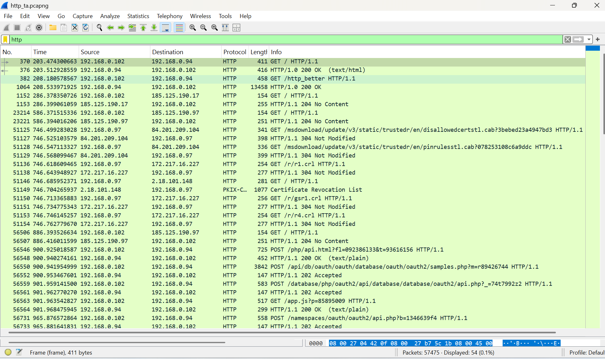
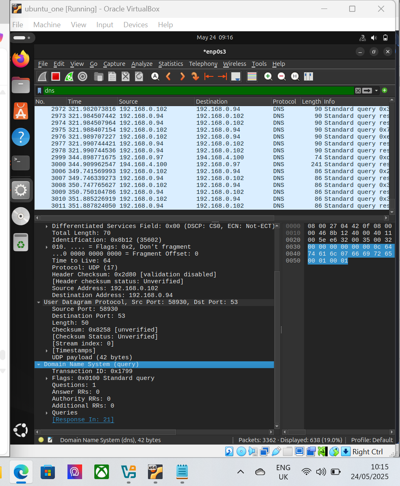
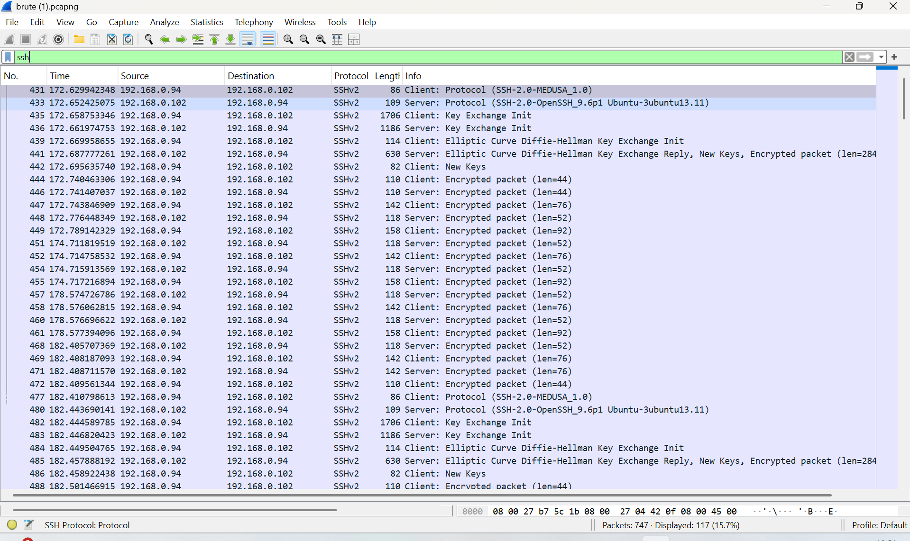
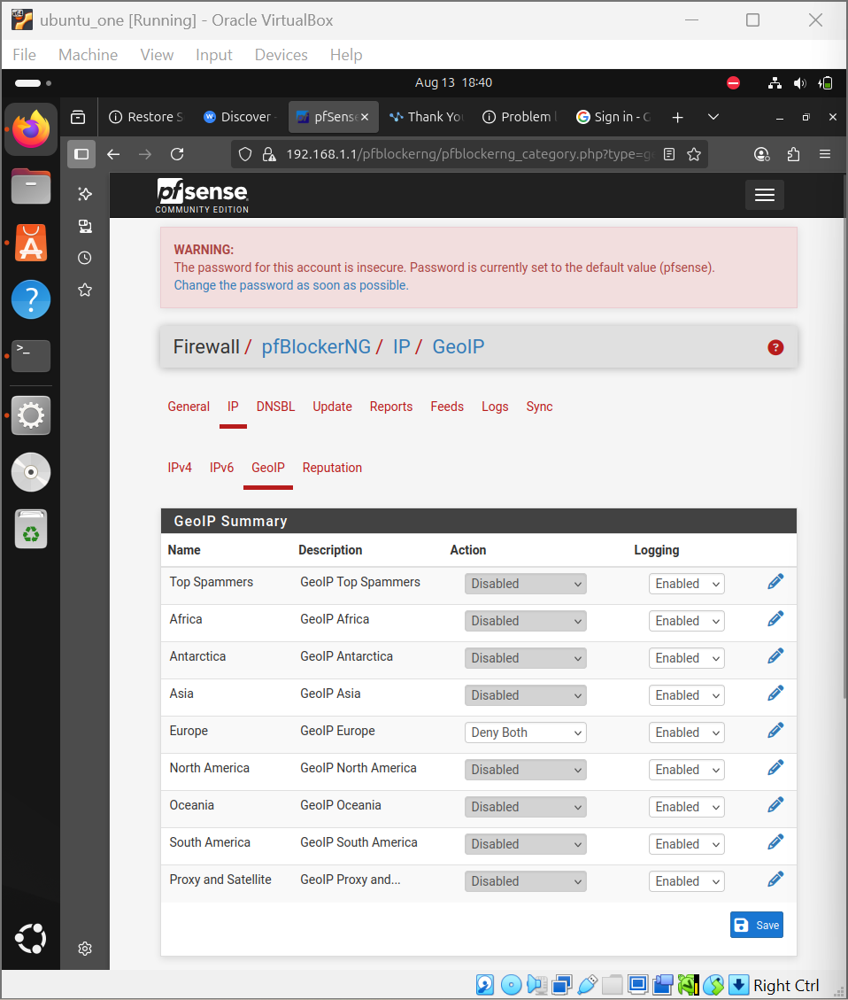
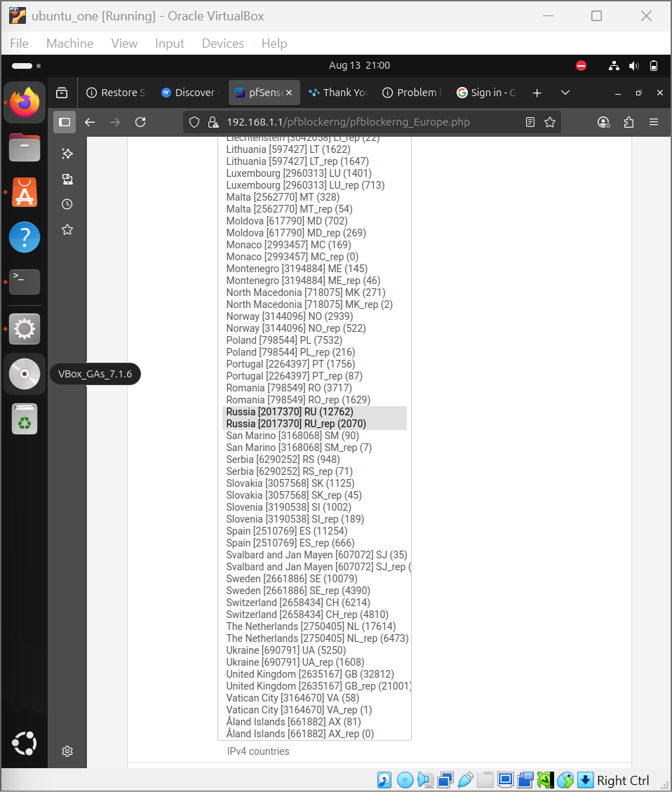
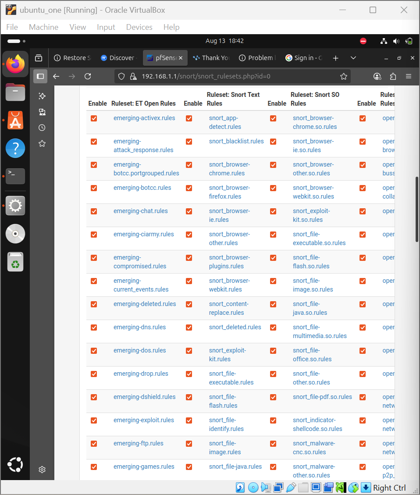
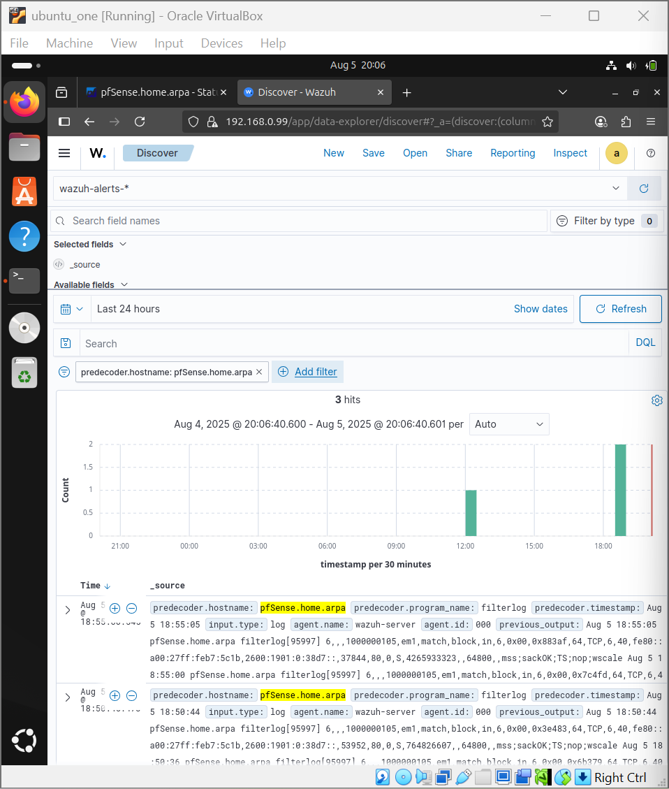

# SOC-ANALYSIS
## Overview
This project stimulates a cyber attack scenerio and demonstrates detection and prevention using:
- Wireshark
- Pfsense
- Snort(IDS/IPS)
- Wazuh (SIEM and Monitoring)

## Objectives
- Stimulate attack (Http beaconing, DNS beaconing and bruteforce attack)
- Detect Anomally (Wireshark)
- Creating a firewall (PFSENSE)
- Block Malicious IP
- Monitor logs with Wazuh

  ## Tools Used
- Pfsense
- Wazuh
- Snort
- Kali
- Ubuntu
- Wireshark

  ## Project Architecture
  The SOC monitoring environment consist of:
   **Wireshark** - Packet capture and traffic analysis
  **pfSense** - Firewall configurationand geo-blocking
  **Snort IDS/IPS** - Intrusion detection and rule-based blocking
  **Wazuh SIEM** - Centralized logging and monitoring

                    Attacker (Kali Linux)
                            │
                            ▼
                    Network Traffic
                            │
                            ▼
                    Wireshark Analysis
                            │
                            ▼
                    pfSense Firewall + Snort IDS
                            │
                            ▼
                    Wazuh SIEM Monitoring

  ## Phase 1: Network Analysis with Wireshark
  Wireshark was used to capture and analyse network traffic in order to detect anomalies reported by theorganization.
  The analysis focused on detecting:
  - DNS beaconing
  - HTTP command and control communication
  - SSH brute force attacks

 **HTTP Beaconing Detection**
   - Suspicious HTTP request such as /http_better
   - Repeated communication withunknown IP: 192.168.0.94
   - continous GET and POST requests from the same IP
   - Lond and encoded parameters
   - Access to multiple suspicious JavaScrript payloads
     
**Screenshot**

**DNS BEACONING DETECTION**
Wireshark analysis revealed patterns consistent with DNS beaconing. Indicators Included:
 - DNS queries occuring with milliseconds
 - Alternating source and destination IP addresses
 - Abnormal DNS request patterns
 - No corresponding HTTP/HTTPS traffic
 - Repeated A and AAA record queries
 - Packets with identical lengths

**Screenshot**

**BRUTEFORCE ATTACK**
 A bruteforce attack targeting SSH services was detected. Indicators included:
- Client indentified as Medusa brute force tool
- High volume of SSH login attempts
- Repeated connections between IP addresses
- Continous failed key exchange attempts
- No successful session interaction

  **Screenshot**
  

  ## PHASE 2: FIREWALL PROTECTION WITH PFSENSE
  After identifying malicious activity, pfSense firewall rules were implemented to mitigate thet threats.
 **Actions taken:**
  - Geo-blocking for high-risk region in my context was Russia
  - Blocking inbound and outbound traffic
  - Additional  monitoring through Snort IDS

 **Note: When pfSense is deployed, the operating system IP address may change due to firewall configuration**

**Geo-IP Blocking**
Threat intelligence indicated significant attack activity originating from Russia. Firewall rules were created to: 
- Block inbound connections from Russia
- Block outbound traffic to Russia.
  **Testing was performed by attempting to access "yandex.ru (A russia site)"**
  The request was successfully blocked by the firewall.
  **Screenshot**
  
  

  ## PHASE 3: INTRUSION DETECTION WITH SNORT
  Snort was deployed on pfsense to detect and prevent netwrok attacks. Detected activity included:
  - SSH brute-force attempts on port 22
  - Source IP identified as: "192.168.1.101"
  - Real-time alerts triggered by Snort rules.
  - Other additional rules were enabled such as Trojan, Ddos patterns, DNS attacks etc.
 
  **Screenshot**
  
  

## PHASE 4: Centralized Monitoring with Wazuh SIEM
Wazuh was used to collect logs from pfSense and provide centralized monitoring.
**Key Capabilities:**
-Log collection from pfSense
-Detection of security events
-Analysis of Snort alerts
-Incident monitoring through the Wazuh dashboard
**The logs included:**
- Decoder name (Snort)
- pfSense event logs
- Network security alerts.

  **Screenshots**
  
